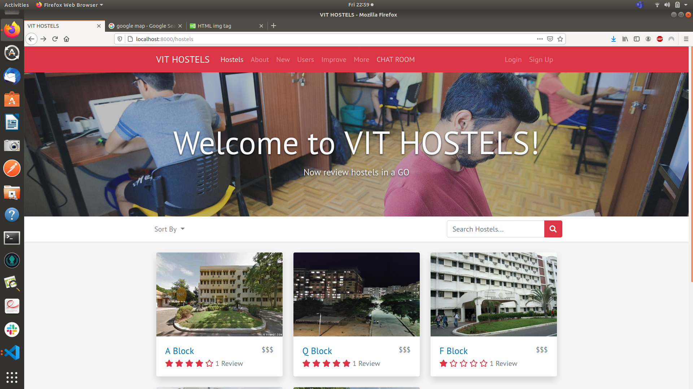

# VIT HOSTELS


VIT HOSTELS is a website where users can create and review hostels. In order to review or create a hostel, you must have an account. This project was part of our IWP course and was developed under prof Naveen Kumar N.

This project was created using Node.js, Express, MongoDB, and Bootstrap. Passport.js was used to handle authentication.  

## Features
* Users can create, edit, and remove HOSTELS
* Users can review hostels once, and edit or remove their review
* User profiles include more information on the user (full name, email, phone, join date), their hostels, and the option to edit their profile or delete their account
* Search hostels by name or location
* Sort hostels by highest rating, most reviewed, lowest price, or highest price



## Run it locally
1. Install [mongodb](https://www.mongodb.com/)
2. Create a cloudinary account to get an API key and secret code

```
git clone https://github.com/shashu421/VIT-HOSTELS.git
cd vithostels
npm install
```

Create a .env file (or just export manually in the terminal) in the root of the project and add the following:  

```
DATABASEURL='<url>'
API_KEY=''<key>
API_SECRET='<secret>'
```

Run ```mongod``` in another terminal and ```npm start``` in the terminal with the project.  

Then go to [localhost:8000](http://localhost:8000/).

To get google maps working check [this](https://github.com/nax3t/google-maps-api) out.

This project is builded with four additional Technologies which makes this project unique , they are golang , react , firebase and PHP.
To run them and use them you have to run them individually.

For Running Chatroom(React and Firebase)
```
cd chatroom
npm start

```

For Running golang(Suggestion box)
```
cd finalgo
install some dependencies(if required using go get)
go run main.go

```

For Running PHP
```
Open up your XAMPP server
Load phpmysql and our sql file(student.sql)
Run php file

```

These all are connected to our vithostels server you can access this using the navbar of vithostel's frontend (i.e is Chatroom , improve , More).

Enjoy Using these and Write your suggestion in Improve(If any)
Enjoy CODING!!
